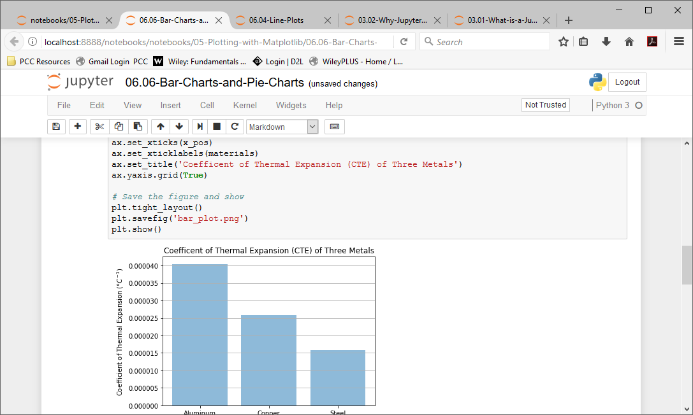
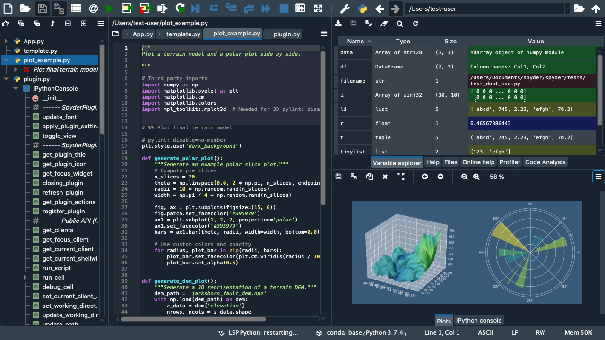

```{r xaringanExtra, echo = FALSE}
  xaringanExtra::use_progress_bar(color = "#035AA6", location = "bottom")
```

<!-- edit name1 and name2 in the YAML above -->

# Why should I care?

<br />
<br />
--

* Good research practice means easier project.

--

* Honestly, research is hard if you don't have a plan. 

--

* These tools save you times.

--

* Your supervisors will be able to add and adapt more easily.

--

* Because they are fun!
---

# Integrated Development Environment (IDEs)

<br />
--

The main choices are:

--

* **RStudio**

--

* **Jupyter Notebooks**

--

* **Spyder**

--

* **MATLAB**

--

* **Visual Studio Code**

--

There are others (Emacs, Atom, XCode). The choice is your own!

---

# RStudio

--


---

# Jupyter 

--



---

# Spyder

--


---

# MATLAB

--


---

# Mathematical Software

--

<br/>

The most useful mathematical software to be aware of is

--

* **Wolfram Mathematica** - Imperial has a free educational license!

--

* **R/MATLAB/Python** - Your supervisor will expect you to use one of the three of them.

--

* **Maple** - Symbolic and numeric computing environment that some of you may want.

--

* **LEAN** - computational proof solving (it can be a bit difficult to learn!).

---

# Reference Managers

--

You should use a reference manager but the choice of which is completely up to you! The common ones are:

--

* **Zotero** - Collect, organise, and cite references in various formats. Automatically generate bibliographies and citations in different styles.

--

* **Mendeley** - Store, organise, and annotate PDFs, as well as share references with other researchers. It also includes a social networking feature that allows users to connect with other researchers in their field.

--

* **EndNote** - Web-based site and a mobile app for on-the-go access.

--

* **RefWorks** - A simple reference manager with minimal bloatware.

--

* **Citavi**

--

* **Papers**

---

# Bourne-Again SHell (BASH)

--

<br/>

Bash, is a command-line interface (CLI) that is widely used in Unix-based operating systems.

--
Bash provides a powerful set of commands and features for interacting with the operating system and performing various tasks, such as:

--

* Navigating the file system.

--

* Managing processes.

--

* Executing programs.

--

* Write scripts to automate tasks.

---

# Navigating the file system

<br/>

--

To list the contents of a directory, use the 'ls' command.

```{bash, eval = FALSE}
ls 
```

<br/>

--

To change to a different directory, use the 'cd' command:

```{bash, eval = FALSE}
cd /path/to/directory
```

<br/>

--

To go up one directory, use 'cd ..' command.

```{bash, eval = FALSE}
cd ..
```

---

# Managing Processes

<br/>

--

To see a list of running processes, use the 'ps' command.

```{bash, eval = FALSE}
ps
```

--

<br/>

To kill a process, use the 'kill' command.

```{bash, eval = FALSE}
kill PID
```

Replace "PID" with the process ID of the process you want to kill.

---

# Executing Programs

<br/>
<br/>
<br/>

--

To execute a program, simply type the name of the program.

```{bash, eval = FALSE}
program_name
```

---

# Writing Scripts

--

To create a new script file, use the 'touch' command.

```{bash, eval = FALSE}
touch my_script.sh
```

--

To edit the script file, use a text editor such as 'nano'.

```{bash, eval = FALSE}
nano my_script.sh
```

--

In the text editor, you can write your script using Bash commands and syntax. For example:

```{bash, eval = FALSE}
#!/bin/bash
echo "Hello, world!"
```

---

# Writing Scripts (Cont.)

<br/>

--

To execute the script, make it executable using the "chmod" command.

```{bash, eval = FALSE}
chmod +x my_script.sh
```

--

<br/>

Then, run the script:

```{bash, eval = FALSE}
./my_script.sh
```

--

To execute multiple:

```{bash, eval = FALSE}
./script1.sh & ./script2.sh &
```

---

# The Servers

<br/>
<br/>

--

To SSH into the shell:

```{bash, eval = FALSE}
ssh username@server_ip_address
```

--

<br/>

To copy files:

```{bash, eval = FALSE}
scp -r username@server_ip_address:path/to/folder /path/to/local/folder
```
---
class: center, middle

# Questions

Please ask questions or submit them at [menti.com](https://www.menti.com/alt3tyaqfpoa) using code **2147 9825**